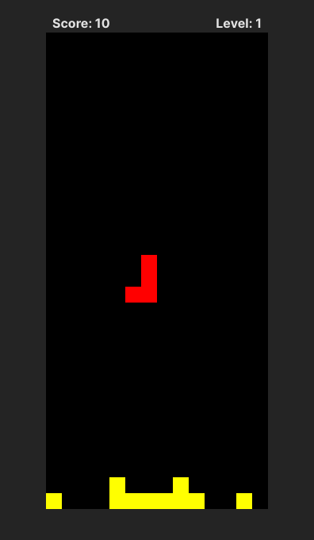

# Tetris JS

## Overview

This is a Tetris game implemented using JavaScript, HTML, and CSS. The game is based on the popular Tetris game and is built following the tutorial provided in the [YouTube video](https://www.youtube.com/watch?v=pNiyz0sl1no).

<a href="./public/screenshot.png" title="Click to view full size">

</a>

## Features

- Classic Tetris gameplay
- Score tracking
- Game over and restart functionality
- Level progression
- ~~Next piece preview~~ (not implemented yet)
- ~~Sound effects~~ (not implemented yet)
- ~~Responsive design for various screen sizes~~ (not implemented yet)

## Installation

1. Clone the repository:

```bash
git clone https://github.com/your-username/tetris-js.git
```

2. Start the app:

```bash
npm run dev
```

3. Open your browser and navigate to `http://localhost:5173` to play the game.

## Acknowledgements

- [midudev](https://github.com/midudev/midudev) for the tutorial and inspiration.
